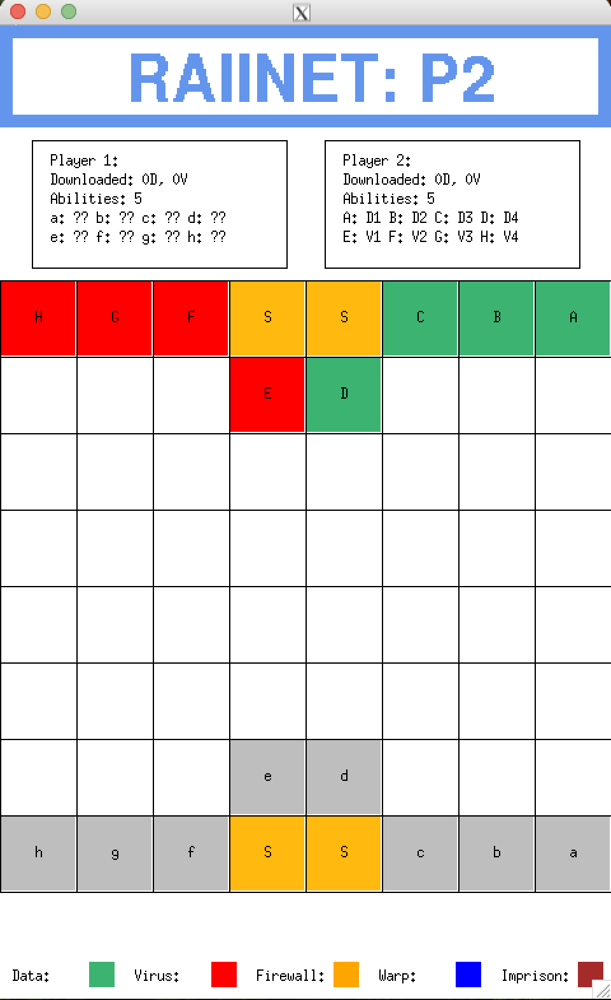
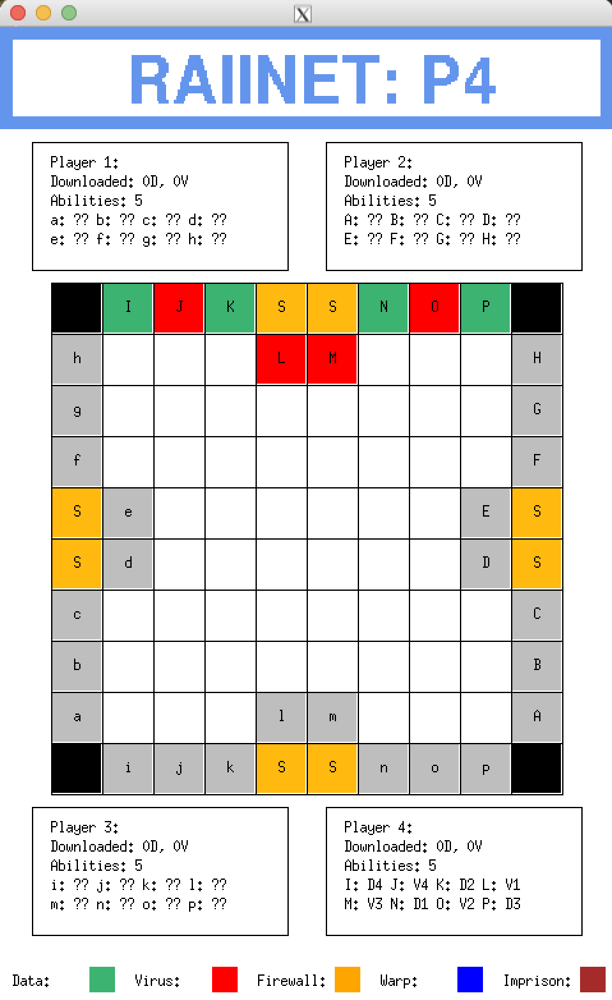

# Raiinet
### RAIInet is a strategy-based networking game where players compete to dominate a grid-based digital arena by capturing server ports and outmaneuvering opponents. Players control "links" (game pieces) and use unique abilities to manipulate the board, defend their network, and disrupt their opponents. The game supports both 2-player and 4-player modes, and offers immersive gameplay through both text-based and graphical displays. 
  <h3>Features:</h3>
    <ul>
        <li><strong>MVC architecture:</strong> The Game class controls the game state, the Observers manage output while the Controller manages control flow and user input.</li>
        <li><strong>Multiple displays:</strong> Implemented using the Observer design pattern, each player can have their own text and graphical display.</li>
        <li><strong>4-Player Mode:</strong> Expanded gameplay 4-Player functionality, with elimination mechanics and board changes.</li>
        <li><strong>Graphical Interface:</strong> Designed with X11 for an interactive and visually appealing experience.</li>
        <li><strong>Smart Pointers:</strong> Used throughout for robust memory management (no explicit deletion).</li>
        <li><strong>Extra Abilities:</strong> Added 5 new abilities, extending the core gameplay mechanics.</li>
    </ul>

  

    <h3 style="text-align: center;"> 2-Player display: </h3>
    
 

    
  

  

    <h3 style="text-align: center;"> 4-Player display: </h3>
      
 

    
  

